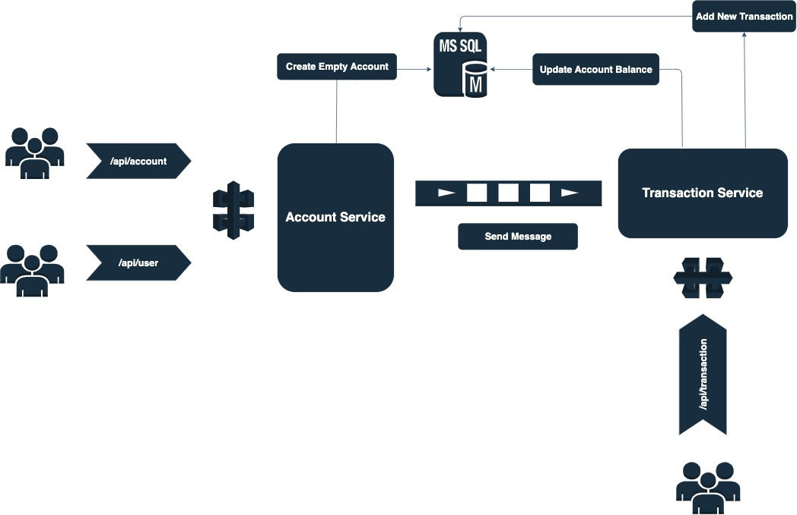

# Introduction

The Bank application is a banking application which is responsible for creating users, opening account and handling transactions. 

# Code overview

The project has three components:

- `account-service` is a Java service that is responsible for adding new `users` and opening a new `accounts`.
- `transaction-service` is a Java service that is responsible for updating `accounts` and recording `transactions`.
- `bank-app` is a react application that runs on the browser and connects to the REST API offered by the `account` and `transaction` services.

# Architecture

The above picture shows the design architecture for this project. The design has two services `transaction-service` and `account-service`.

`Account-service` has these APIs:
* `Post /api/user` creates a new user
* `Post /api/account` opens an account for an existing user
* `Get  /api/user/{id}` returns user information for given customer id

This service can create a new user. Also, it opens an empty account for the user and if the initial credit is greater than zero, then it sends a message to the `transaction-service`.

`Transaction-service` has one API:
* `Get /api/transaction/{id}` returns transactions for the given customer id

This service receives messages from `account-service`. Then it will update the account balance and also records the transaction.

In order to have decoupled services, I used `rabitmq` as a message broker between these two services. This architecture can help us to scale up the system easier in the future. Moreover, I used mysql as the database for persisting and retrieving data. It is good to mention for sake of simplicity, I used one shared database between two microservices.

# More technical discussion

**Failed transaction**:  There is a case where an empty account will be created by `account-service` and a new message is sent to `transaction-service` to update the balance and record the transaction. If the second operation is failed, then we are faced with an account without balance which is wrong.
To fix this issue we should have a retry mechanism in `transaction-service`. If after a couple of retires, the transaction is still not successful, then we can design a new service called `reconsilation-service` which is responsible to fix/rollback these failed transactions.

**Concurrent request**: If concurrent users with the same `customerId` try to open an account. Then we might have a race condition. In order to fix this issue, I used the repeatable read isolation level for the MySQL database in transactional-service to deal with race conditions. Using this isolation level, only one transaction will succeed and the rest have to be retried.

# Running the application

Before running the application make sure that the following tools are available in the command line path. (Please note that I have only tested this application on macOS)

- `mvn` The Java Maven build tool
- `Docker-Desktop` or (`docker` and `docker compose`) for running the containers for MySQL and RabbitMQ
- `node` NodeJS runtime (for the web app)
- `yarn` NodeJS build tool

To run the application, run the `run.sh` script which spins up the docker services.
After it is running, you can check the each individual service via its URL:
* `account-service` is accessible here: http://localhost:8081
* `transaction-service` is accessible here: http://localhost:8082
* `bank-app` is accessible here: http://localhost:8083

You can use bank-app user interface and PostMan to test the APIs.

# Running the integration tests

Before running integration tests make sure to execute `run.sh` locally. An alternative (and better) solution would be using `testcontainers` in the real application.

# Technology stack

The Bank application technology stack consists of:

- [Spring Boot](http://docs.spring.io/spring-boot/) as base application layer
- [MySQL](https://www.mysql.com/) as database
- [React](https://facebook.github.io/react/) for creating frontend application
- [RabitMQ](https://www.rabbitmq.com/) a messaging broker to connect two services
